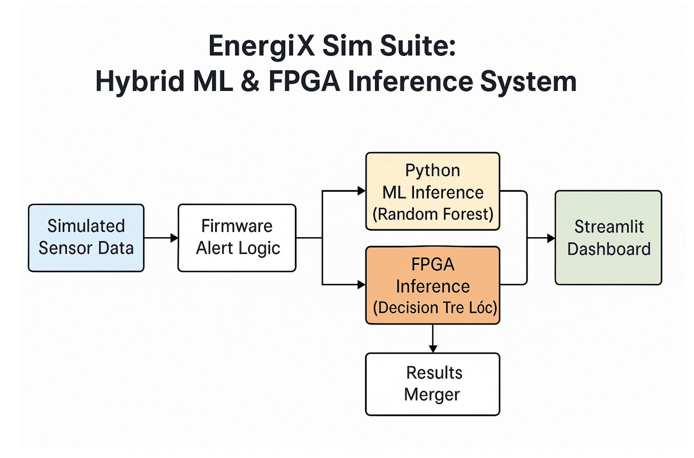
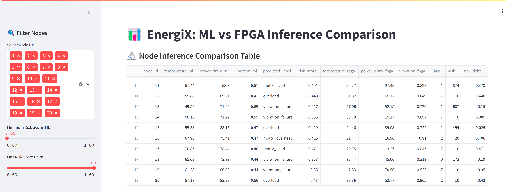

# EnergiX Sim Suite 🚀

**A full-stack, PC-simulated smart energy inference system that compares Software-based ML inference (Python) and Hardware-based ML inference (FPGA-based decision tree logic).**

---

## 🧭 System Overview



---

## 💡 Features
- Sensor simulation pipeline with realistic data
- ML model (RandomForest) trained and evaluated
- FPGA logic (SystemVerilog) for decision tree inference
- Dynamic risk scoring in hardware
- Fully integrated Streamlit dashboard

---

## 🔧 Technologies
- SystemVerilog (Vivado)
- Python (Pandas, NumPy, scikit-learn)
- Streamlit
- Matplotlib
- JSON/CSV data pipelines

---

## 📊 Inference Comparison
Visual dashboard comparing:
- Python ML predictions
- FPGA hardware logic results
- Risk score delta analysis

---



---

## 🔄 How to Run
### Requirements
- Python 3.10+
- Recommended to install using `venv` and `pip install -r requirements.txt`

Open a new terminal:
```bash
git clone https://github.com/ScottTorzewski/energiX-sim.git
cd energiX-sim
python -m venv .venv
.venv\Scripts\activate
pip install -r requirements.txt
streamlit run dashboard/dashboard_app.py

